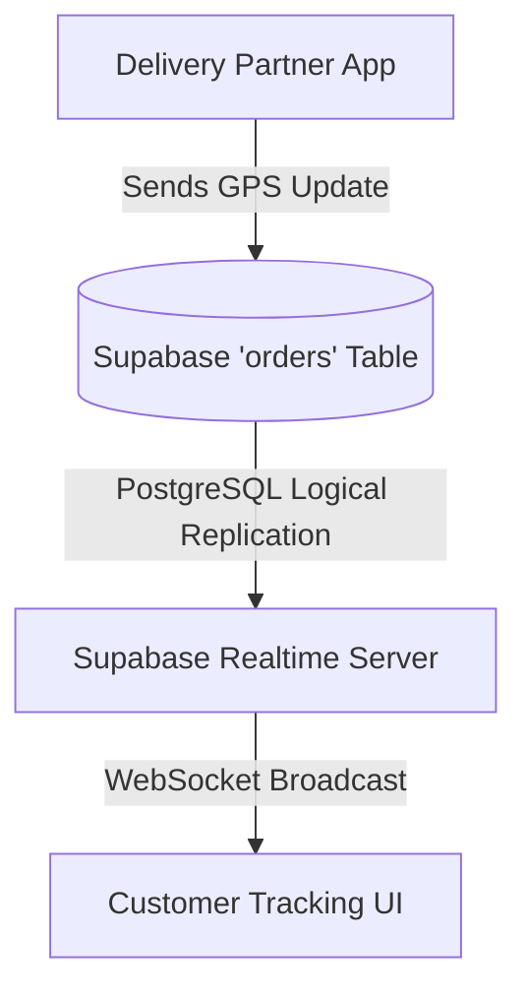

# Real-Time Delivery Tracking System Architecture

This document outlines the backend architecture and integration points for the LocalSell real-time delivery tracking system. It ensures zero-delay updates, scalable connections, and persistent order history.

## 1. System Architecture Overview

The system leverages **Supabase Realtime** (powered by WebSockets and PostgreSQL logical replication) to push GPS updates directly to connected clients (customers) without any page refreshes.



## 2. Core Components

### A. Database Schema (`orders` table)
We extend the `orders` table to include tracking data.

```sql
-- Extend orders table
ALTER TABLE public.orders ADD COLUMN IF NOT EXISTS delivery_status TEXT DEFAULT 'placed';
ALTER TABLE public.orders ADD COLUMN IF NOT EXISTS tracking_lat NUMERIC(10, 7);
ALTER TABLE public.orders ADD COLUMN IF NOT EXISTS tracking_lng NUMERIC(10, 7);
ALTER TABLE public.orders ADD COLUMN IF NOT EXISTS last_location_update TIMESTAMP WITH TIME ZONE;
ALTER TABLE public.orders ADD COLUMN IF NOT EXISTS delivery_partner_id UUID REFERENCES auth.users(id);

-- Enable Realtime for the 'orders' table
alter publication supabase_realtime add table public.orders;
```

### B. GPS Handling & API Security (Row Level Security)
Delivery partners should only be able to update their assigned orders. Customers can only view their own orders.

```sql
-- Security Policies
ALTER TABLE public.orders ENABLE ROW LEVEL SECURITY;

-- Customers can view their own orders
CREATE POLICY "Customers can view own orders" 
ON public.orders FOR SELECT 
USING (auth.uid() = customer_id);

-- Delivery partners can UPDATE location for their assigned orders
CREATE POLICY "Partners can update assigned orders" 
ON public.orders FOR UPDATE 
USING (auth.uid() = delivery_partner_id)
WITH CHECK (auth.uid() = delivery_partner_id);
```

### C. Client-Side Implementation (React + Supabase JS)

**Delivery Partner App (Sender):**
Uses `navigator.geolocation.watchPosition` to send location chunks.
```javascript
// On Delivery Partner Dashboard
navigator.geolocation.watchPosition(async (pos) => {
  const { latitude, longitude } = pos.coords;
  
  // Update Database directly using authenticated client
  await supabase
    .from('orders')
    .update({ 
      tracking_lat: latitude, 
      tracking_lng: longitude,
      last_location_update: new Date().toISOString()
    })
    .eq('id', currentOrderId)
    .eq('delivery_partner_id', session.user.id); // Extra safety
}, error, { enableHighAccuracy: true });
```

**Customer Tracking App (Receiver):**
Uses Supabase Realtime to listen for `UPDATE` events on their specific order.
```javascript
// On Customer OrderTrackingPage.jsx
useEffect(() => {
  const channel = supabase
    .channel('order-tracking')
    .on(
      'postgres_changes',
      {
        event: 'UPDATE',
        schema: 'public',
        table: 'orders',
        filter: `id=eq.${orderId}`
      },
      (payload) => {
        const { tracking_lat, tracking_lng, delivery_status } = payload.new;
        
        // Update Map Location smoothly
        setPartnerLocation({ lat: tracking_lat, lng: tracking_lng });
        
        // Update Status Timeline
        setOrderStatus(delivery_status);
      }
    )
    .subscribe();

  return () => {
    supabase.removeChannel(channel);
  };
}, [orderId]);
```

## 3. Performance & Scalability Considerations

1. **Throttling Updates:**
   To prevent database overload ("No lag or UI breaking issues"), the delivery partner's app should throttle GPS updates. Instead of sending every micro-movement, send updates every 5 seconds or if distance changed by > 10 meters.
   
2. **WebSocket Limits:**
   Supabase Realtime supports millions of concurrent connections. By using filtering (`filter: id=eq.${orderId}`), the customer only receives payloads relevant to their order, preventing duplicate updates and reducing client-side load.

3. **Tracking History:**
   For auditing or resolving disputes, a separate `order_tracking_history` table could be created, triggered via a Postgres function whenever the `orders` table updates its location.

```sql
CREATE TABLE IF NOT EXISTS public.order_tracking_history (
    id UUID DEFAULT uuid_generate_v4() PRIMARY KEY,
    order_id UUID REFERENCES public.orders(id) ON DELETE CASCADE,
    lat NUMERIC(10, 7),
    lng NUMERIC(10, 7),
    recorded_at TIMESTAMP WITH TIME ZONE DEFAULT NOW()
);

-- Use a Postgres trigger to populate this automatically
```
